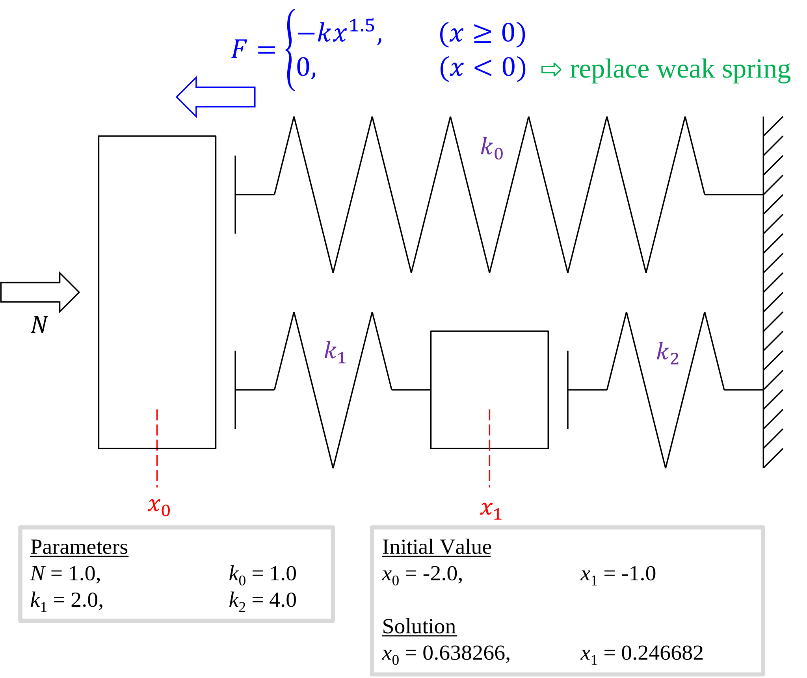

# Usage of Ceres Solver - Solving the balancing of the spring system

## What is Ceres Solver?

Ceres Solver 1 is an open source C++ library for modeling and solving large, complicated optimization problems. It can be used to solve Non-linear Least Squares problems with bounds constraints and general unconstrained optimization problems. It is a mature, feature rich, and performant library that has been used in production at Google since 2010. For more, see Why?.

ceres-solver@googlegroups.com is the place for discussions and questions about Ceres Solver. We use the GitHub Issue Tracker to manage bug reports and feature requests.

### Ceres Built Environment

Do these preparations in advance:

1. Get Eigen (not necessary to build)
1. Get gflag and build it.
1. Get glog and build it.
1. Get ceres-solver and build it.

In the following steps, it is assumed that the file is built with `C:\Git`.

#### Additional include directories

```console
C:\Git\ceres-solver\vsbuild\config
C:\Git\ceres-solver\include
C:\Git\glog\vsbuild
C:\Git\glog\src
C:\Git\glog\src\windows
C:\Git\gflags\vsbuild\include
C:\Eigen3\include\eigen3
```

#### Additional dependent files

```console
C:\Git\ceres-solver\vsbuild\lib\Release\ceres.lib
C:\Git\glog\vsbuild\Release\glog.lib
C:\Git\gflags\vsbuild\lib\Release\gflags_static.lib
```

#### dynamic linking library

Put `glog.dll` in a directory with a path. I put it in the same directory as `.exe`.

```console
NDEBUG
_USE_MATH_DEFINES
_VARIADIC_MAX=10
CERES_EXPORT_INTERNAL_SYMBOLS
GLOG_NO_ABBREVIATED_SEVERITIES
GFLAGS_IS_A_DLL=0
CMAKE_INTDIR="Release"
```

#### Ignore the specified warning

```console
4018;4267;4099;4996;4800;4244;4251
```

## Solving the balancing of the spring system

### Equations



### Source Code

#### include

```cpp
#include <cmath>
#include <iostream>
#include <vector>
#include <ceres/ceres.h>
```

#### Spring System

```cpp
class SpringSystem {

private:
	static double Hertz(double k, double dx) {
		return k * (
			(dx > 0)
			? std::pow(dx, 1.5)
			: std::pow(-dx, 1.5) * -1e-4
			);
	};
	const double k0 = 1.0;
	const double k1 = 2.0;
	const double k2 = 4.0;
	const double F0 = 1.0;

	double x0;
	double x1;

public:
	SpringSystem() {
		this->x0 = -2;
		this->x1 = -1;
	};

	virtual ~SpringSystem() = default;
	SpringSystem& operator=(SpringSystem&& o) = default;

	void getPosition(std::vector<double>& x) const {
		x[0] = this->x0;
		x[1] = this->x1;
	};

	void setPosition(double const* const x) {
		this->x0 = x[0];
		this->x1 = x[1];
	};

	void getForce(double * F) {
		double dx0 = this->x0;
		double dx1 = this->x0 - this->x1;
		double dx2 = this->x1;

		F[0] = -Hertz(this->k0, dx0) - Hertz(this->k1, dx1) + this->F0;
		F[1] = Hertz(this->k1, dx1) - Hertz(this->k2, dx2);
	};
};
```

#### Spring System Cost Functor

```cpp
struct SpringSystemCost {

private:
	std::shared_ptr<SpringSystem> SS_;

public:
	explicit SpringSystemCost(std::shared_ptr<SpringSystem> SS) : SS_(SS) {
	}
	virtual ~SpringSystemCost() = default;

	bool operator()(double const* const* parameters, double* residual) const {
		SS_->setPosition(parameters[0]);
		SS_->getForce(residual);
		return true;
	}

	static auto Create(
		std::shared_ptr<SpringSystem> SS,
		const ceres::NumericDiffOptions&diffoptions
	) {
		auto cost_function =
			new ceres::DynamicNumericDiffCostFunction<
			SpringSystemCost,
			ceres::CENTRAL
			>(
				new SpringSystemCost(SS),
				ceres::TAKE_OWNERSHIP,
				diffoptions);

		int abs_point_size = 2 * 1;
		int residual_size = 7 - 5;

		cost_function->AddParameterBlock(abs_point_size);
		cost_function->SetNumResiduals(residual_size);

		return cost_function;
	}
};
```

#### main

```cpp
void printXF(std::shared_ptr<SpringSystem> SS);

int main(int argc, char** argv) {

	auto SS = std::make_shared<SpringSystem>();

	const int n = 1 + 1;
	std::vector<double> x(n);
	SS->getPosition(x);
	printXF(SS);

	ceres::NumericDiffOptions diffoptions;
	diffoptions.relative_step_size = 1e-9;

	auto cost = SpringSystemCost::Create(SS, diffoptions);

	ceres::Problem problem;
	problem.AddResidualBlock(cost, NULL, x.data());

	ceres::Solver::Options options;
	options.max_num_iterations = 100;
	options.linear_solver_type = ceres::DENSE_QR;
	options.minimizer_progress_to_stdout = true;
	ceres::Solver::Summary summary;
	ceres::Solve(options, &problem, &summary);

	std::cout << summary.FullReport() << "\n";

	printXF(SS);

	return 0;
}

void printXF(std::shared_ptr<SpringSystem> SS) {
	std::vector<double> x(2);
	SS->getPosition(x);
	std::cout << "x =\t" << x[0] << ",\t" << x[1] << "\n";

	SS->getForce(x.data());
	std::cout << "F =\t" << x[0] << ",\t" << x[1] << "\n\n";
}
```

## Result

### Console

```console
x =     -2,     -1
F =     1.00048,        0.0002

iter      cost      cost_change  |gradient|   |step|    tr_ratio  tr_radius  ls_iter  iter_time  total_time
   0  5.004830e-01    0.00e+00    5.12e-04   0.00e+00   0.00e+00  1.00e+04        0    5.33e-05    1.81e-04
   1  3.180613e+10   -3.18e+10    5.12e-04   2.56e+03  -6.36e+10  5.00e+03        1    5.16e-05    5.74e-04
   2  3.174802e+10   -3.17e+10    5.12e-04   2.56e+03  -6.34e+10  1.25e+03        1    1.70e-05    7.89e-04
   3  3.140292e+10   -3.14e+10    5.12e-04   2.54e+03  -6.27e+10  1.56e+02        1    1.49e-05    9.25e-04
   4  2.845376e+10   -2.85e+10    5.12e-04   2.43e+03  -5.70e+10  9.77e+00        1    1.43e-05    1.08e-03
   5  9.338899e+09   -9.34e+09    5.12e-04   1.43e+03  -2.23e+10  3.05e-01        1    1.32e-05    1.21e-03
�m...]
  37  3.857635e-10    9.40e-07    5.03e-05   6.85e-04   1.00e+00  7.07e+02        1    2.71e-05    3.07e-02
  38  1.791746e-14    3.86e-10    3.20e-07   1.44e-05   1.00e+00  2.12e+03        1    3.83e-05    3.14e-02
  39  9.320532e-20    1.79e-14    7.23e-10   9.92e-08   1.00e+00  6.36e+03        1    6.42e-04    3.43e-02

Solver Summary (v 2.0.0-eigen-(3.3.8)-no_lapack-eigensparse-no_openmp)

                                     Original                  Reduced
Parameter blocks                            1                        1
Parameters                                  2                        2
Residual blocks                             1                        1
Residuals                                   2                        2

Minimizer                        TRUST_REGION

Dense linear algebra library            EIGEN
Trust region strategy     LEVENBERG_MARQUARDT

                                        Given                     Used
Linear solver                        DENSE_QR                 DENSE_QR
Threads                                     1                        1
Linear solver ordering              AUTOMATIC                        1

Cost:
Initial                          5.004830e-01
Final                            9.320532e-20
Change                           5.004830e-01

Minimizer iterations                       40
Successful steps                           28
Unsuccessful steps                         12

Time (in seconds):
Preprocessor                         0.000128

  Residual only evaluation           0.000778 (40)
  Jacobian & residual evaluation     0.000169 (28)
  Linear solver                      0.000485 (40)
Minimizer                            0.034983

Postprocessor                        0.000015
Total                                0.035126

Termination:                      CONVERGENCE (Parameter tolerance reached. Relative step_norm: 3.312080e-10 <= 1.000000e-08.)

x =     0.638266,       0.246682
F =     -2.52243e-13,   -2.1072e-13
```

### Consideration


